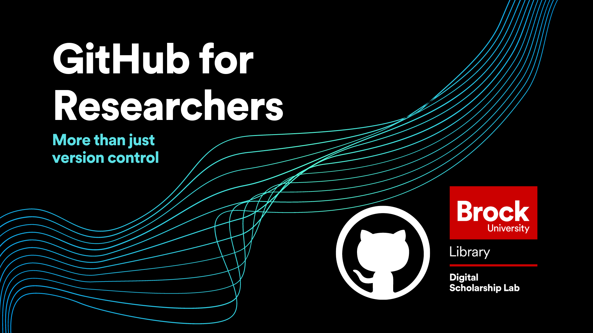
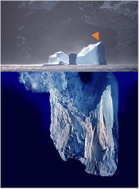

# Github for Researchers

## What

This interactive workshop ([PPT](https://github.com/BrockDSL/github_for_researchers/blob/master/Overview.pptx?raw=true)) will teach you the basics of how to interact with Github as if you were a researcher looking to share a research project. 

It follows a scenario that goes through a few stages:

1. Hosting code and data with Github ([PDF](https://raw.githubusercontent.com/BrockDSL/github_for_researchers/master/p1.pdf
))
2. Interacting with a collaborator that makes a change to your code ([PDF](https://raw.githubusercontent.com/BrockDSL/github_for_researchers/master/p2.pdf
))
3. Turning your repository into a webpage to showcase your work ([PDF](https://raw.githubusercontent.com/BrockDSL/github_for_researchers/master/p3.pdf
))
4. Adding more data that you've collected to your repository ([PDF](https://raw.githubusercontent.com/BrockDSL/github_for_researchers/master/p4.pdf
))
5. Adding a simple action to your repository ([PDF](https://raw.githubusercontent.com/BrockDSL/github_for_researchers/master/p5.pdf
))

## Prerequisites
The only thing you'll need for the session is an account on [GitHub](https://github.com/join). We'll be just using the web interface, so no extra software needs to be installed.

## When
For dates and times when this workshop will be held please consult either:

- [Eventbrite](https://brockdsl.eventbrite.com)
- [ExperienceBU](https://experiencebu.brocku.ca/organization/dsl)

(If no scheduled sessions work for you please get in touch with us and we'll arrange something, details down below)

## A Final word

Github is a very sophisticated tool, capable of quite a lot, this workshop is perfect for beginners who have never used it before. We will explore the tip of the iceberg in the workshop.

-----

**This tutorial is brought to you by the Brock University Digital Scholarship Lab.  For more information on the DSL check out our website at [www.brocku.ca/library/dsl/](https://brocku.ca/library/dsl/) or you can e-mail us at dsl@brocku.ca.**  

You can also find us on:  
[Facebook](https://www.facebook.com/Brock-University-Digital-Scholarship-Lab-349407235866792/)  
[Twitter](https://twitter.com/brock_dsl)  
[Instagram](https://www.instagram.com/brock_dsl/?hl=en)  
[YouTube](https://www.youtube.com/channel/UC2eEqPkDo-1N3qilxv-N_1g/featured?view_as=subscriber)