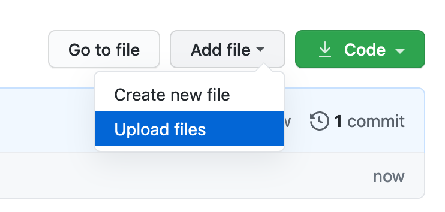

# GitHub for Researchers

## Part 1

You are a researcher who has put together 2 things:
- A bit of code that does some analysis
- A dataset

You’d like to put this online and get feedback from your colleagues, establish connections around this

## Step

### Creating the Repository

1. Start at [https://github.com/new](https://github.com/new)
2. Give the Repository a good name
3. Click  *Add a README file*
4. Click *Create Repository*

### Adding your initial info and commiting changes

1. Download the [code](https://raw.githubusercontent.com/BrockDSL/github_for_researchers/master/analyze.py) file (Right click  & Save As to Your Desktop)
2. Download the [data](https://raw.githubusercontent.com/BrockDSL/github_for_researchers/master/data.txt) file (Rick click & Save As to Your Desktop)

3. Click on *Add File -> Upload Files* 
4. Choose the two you downloaded in the steps above files
5. Add a note to commit changes, something like "inital project upload"
6. Click *Commit changes*

7. Return to the main page of your reposity and click *Commits* to see the progress thus far!

### Sharing repository with a collaborator

1. Click *Settings* along the top

2. Click *Manage access*
3. Click *Invite a collaborator*

4. Type _elibtronic_ in the search box
5. Click *Add elibtronic to this repository*

4. Return to main page of repository
5. Click *Code*

6. Copy/Paste the URL in the bar to the Zoom chat box

## Congrats!

You've setup your project and shared it with a collaborator.