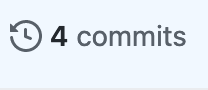
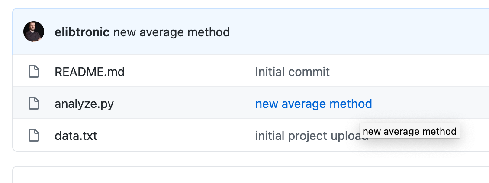
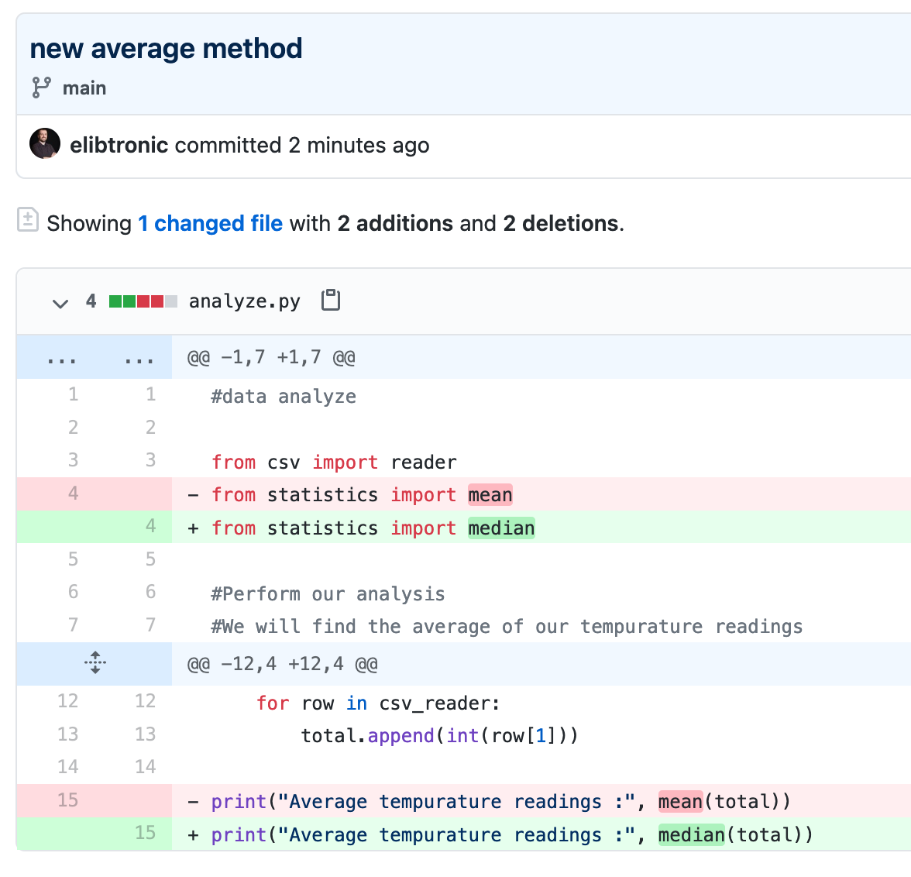

# GitHub for Researchers

## Part 2

A collaborator has added some changes to your code!
Let’s load up those changes

## Please Wait!

While you're waiting...check out ISAGE to see how researchers use git [https://investigating-archiving-git.gitlab.io/about/](https://investigating-archiving-git.gitlab.io/about/)

## Steps

1. Refesh your repository website
2. Click *Commits* to see the changes

3. click on *new_average_method* to see the changes in the code!

## Congrats!

Your collaborator has made some changes to your code.