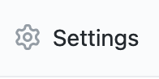
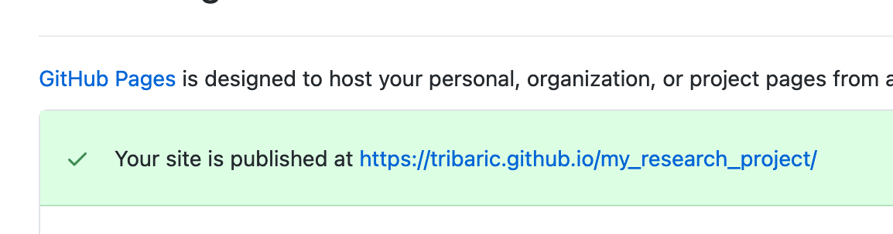

# GitHub for Researchers

## Part 3

You are applying for a grant and you need to make a 'nice' web presence for your project so that it can be accessed by people not familiar with code

## Steps

### Adding more information to the page
1. Return to your Repository Homepage
2. Click *README.md*
3. Click the pencil and make some changes to your repository readme

4. Add the following code to your **README.md** file

`` Welcome to research project``
``[my data](data.txt) | [my_code](analyze.py)``

5. Add a note to commit changes, something like "turning this into a web page", then click *Commit Changes*

### Publish the repository as a web-page
1. Return to your Repository Homepage

3. Click *Settings*

3. Scroll down to section on *GitHub Pages*
4. Change the value from *None* to *Main*

5. Hit *Save*

7. The page will reload, scroll to the bottom and click on *Choose a Theme*

8. Select a nice theme and click *Select Theme*

9. Scroll down the page and click on the link for you published site

**Please note, it make take some time for this to refresh!**

## Congrats!

Your project now lives on the web and has a nice looking webpage

