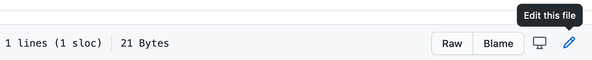
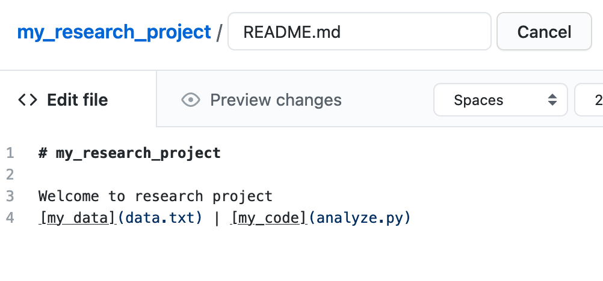
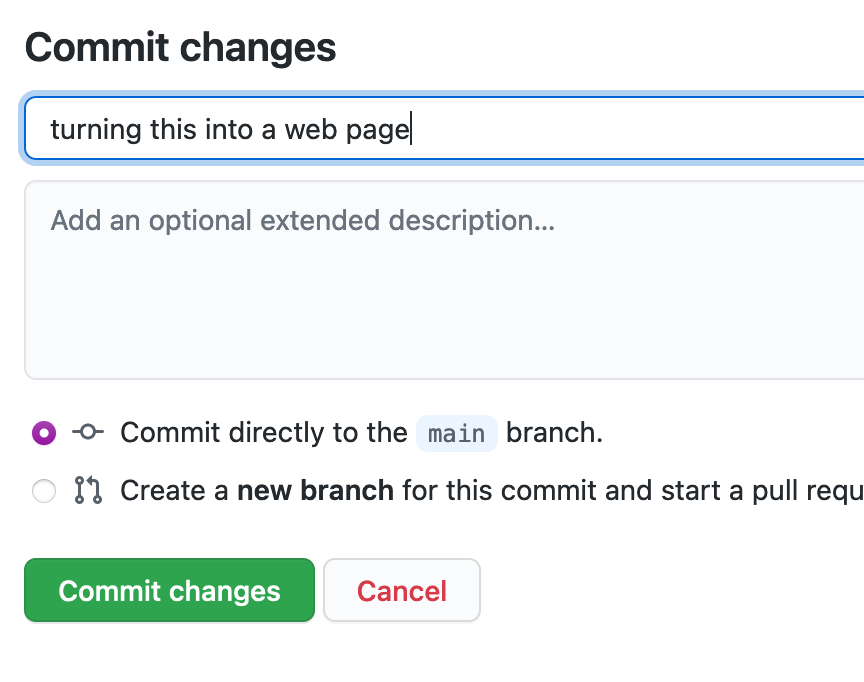
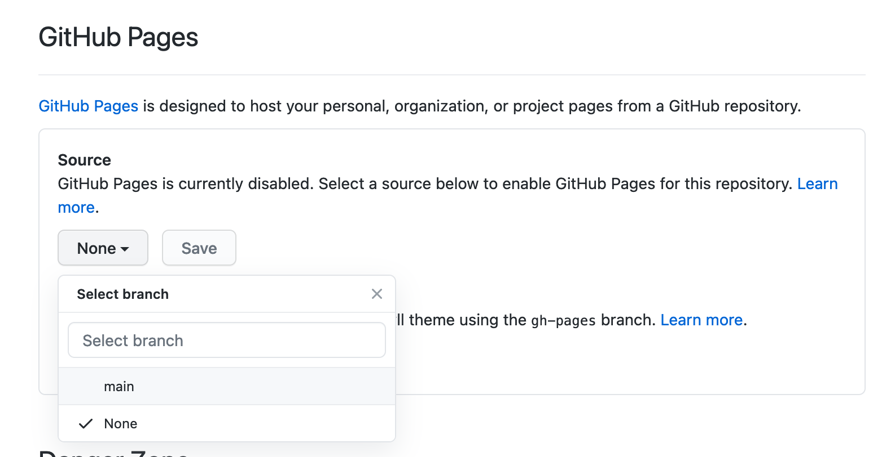
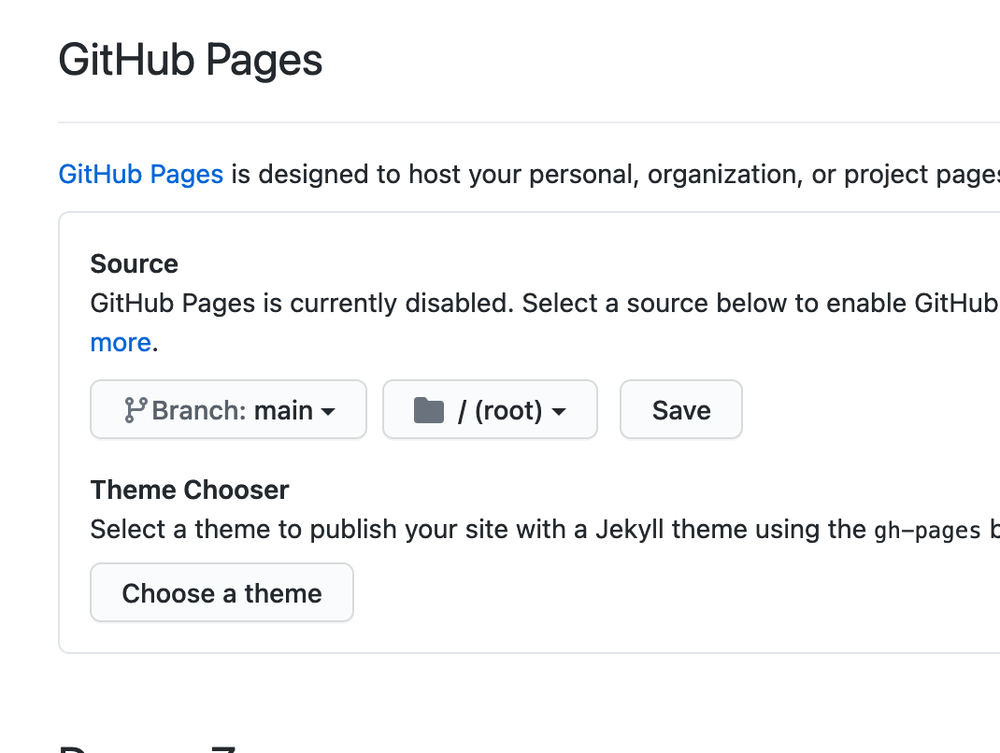
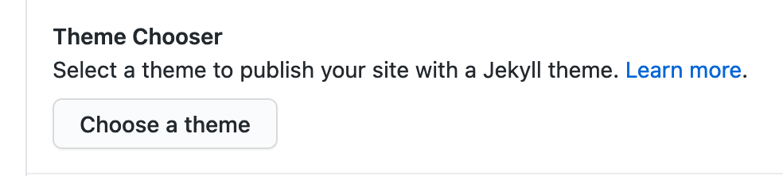
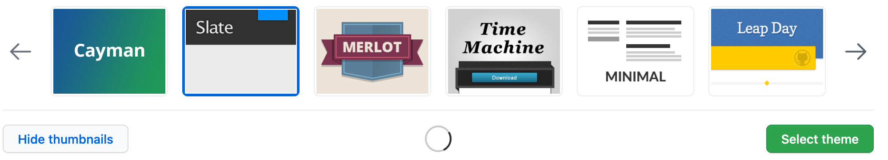

# GitHub for Researchers

## Part 3

You are applying for a grant and you need to make a 'nice' web presence for your project so that it can be accessed by people not familiar with code

## Steps

### Adding more information to the page
1. Return to your Repository Homepage
2. Click *README.md*
3. Click the pencil and make some changes to your repository readme

4. Add the following code to your **README.md** file

`` Welcome to research project``
``[my data](data.txt) | [my_code](analyze.py)``

5. Add a note to commit changes, something like "turning this into a web page", then click *Commit Changes*

### Publish the repository as a web-page

#### Deploy your site

1. Return to your Repository Homepage
2. Click *Settings*
3. Look for  *Pages* in the left menu
4. Change the value from *None* to *Main*

5. Hit *Save*

Return to the main page of your repository and click on 

There you'll be able to watch the build process, and you'll be given the link to your site.

**Please note, it make take some time for this to refresh!**

#### Configure your Theme

Our webpage is a little bland. Let's add a theme to it!

1. Return to the main page your repository. Click 'Add file' -> 'Create new file'

1. Enter the name `_config.yml` in the name your file.
2. In the body of the file add the word `remote_theme:` followed by a space followed by your theme name. EG. to use the Midnight theme `remote_theme: pages-themes/midnight@v0.2.0` 
3. Give the commit a description and hit "Commit new file"

| Example Themes  | line for config|
|---|---|
|[Architect](https://pages-themes.github.io/architect/)|`remote_theme: pages-themes/architect@v0.2.0`|
|[Midnight](https://pages-themes.github.io/midnight/)|`remote_theme: pages-themes/midnight@v0.2.0`|
|[Hacker](https://pages-themes.github.io/hacker/)|`remote_theme: pages-themes/hacker@v0.2.0`|
|[Slate](https://pages-themes.github.io/slate/)|`remote_theme: pages-themes/slate@v0.2.0`|

Complete list of themes [here](https://pages.github.com/themes/)

Return to the main page of your repository and click on 

There you'll be able to watch the build again, this time we'll get a site that is a bit more fancy.

## Congrats!

Your project now lives on the web and has a nice looking webpage
