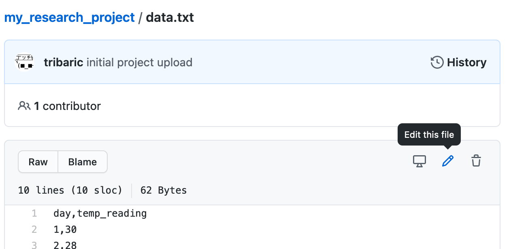
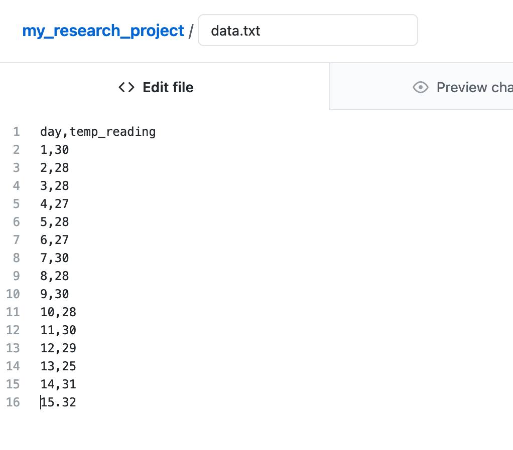
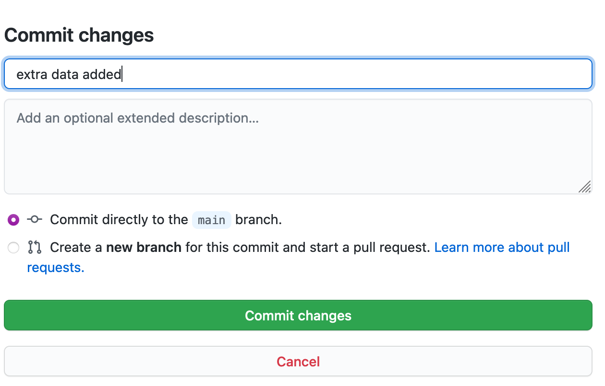

# GitHub for Researchers

## Part 4

Our lab has generated some more data, let’s update our repository for it.

## Steps

1. Return to the main page of your repository
2. Click on *data.txt*
3. Click on the pencil

4. Add the following extra data

  10,28
  11,30
  12,29
  13,25
  14,31
  15.32

5. Add a message to the commit changes box, something like "extra data added"

6. Click *Comment changes*

## Congrats!

You have completed the workshop.