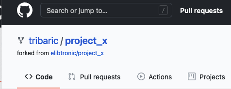

# GitHub for Researchers

## Part 5

We are going to fork a project being worked on by a different team to add to it and make it our own.

## Steps

1. Navigate to [https://github.com/elibtronic/project_x](https://github.com/elibtronic/project_x)

   

2. Click the Fork Button in the upper right hand side of the screen to create your very own copy of the repository.

   

   

3. Modify the image code and the link to point to your version of **project X** by editing the `README.md`. The same way we did with our previous repository.
- click on README.md
- click on the pencil icon to edit the page
- Add your name to the _Collaborators_ list
- Change the image/link to something els
- Add any additional [Markdown](https://github.com/elibtronic/project_x/blob/main/markdown-cheatsheet-online.pdf) you want to the page.

3. _commit_ your code when you are comfortable with it.

4. You'll see that your code has been forked from another repository by looking at the label at the top of the page.

5. Share the link to your repository in the chatbox with the rest of the class so we can see what your forked repository looks like.

   

## Congrats!

You have completed the workshop.