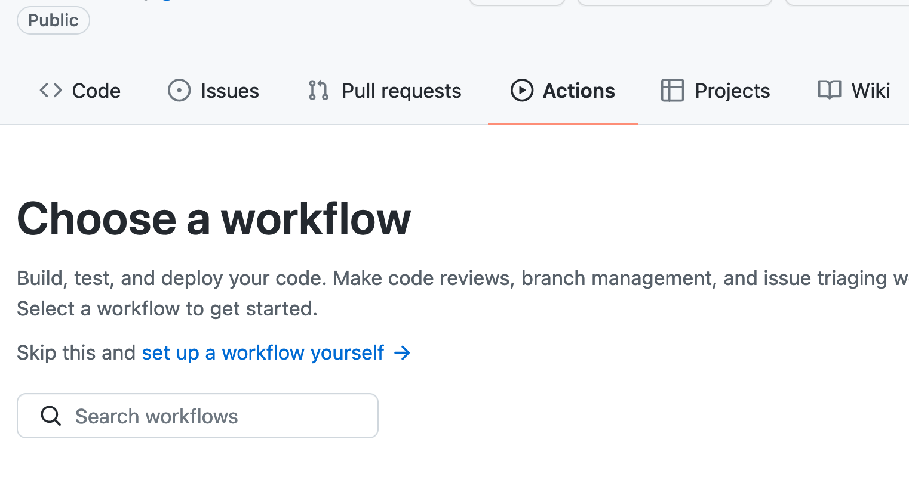

# GitHub for Researchers

## Part 5

We are going to use [GitHub Actions](https://github.com/features/actions) to print a message any time someone pushes to the repository. Our automatic process of turning our repository into a webpage is an example of this.


## Steps

1. Return to the main page of your repository
2. Click the _Actions_ button


3. Click _set up a workflow yourself_



4. Erase what is in the file and copy and paste the following:

```
name: thanks-push
on: push
jobs:
  my-job:
    runs-on: ubuntu-latest
    steps:
      - name: my-step
        run: echo "Thanks for Collaborating"
        
```

5. Click _Start commit_ 
6. Enter in a commit message and click 'Commit new file'
7. Now anytime someone pushes to your repository it will display a message thanking them for their contribution.


## Final Push

Give me two minutes!

## Check Triggered Actions

Click Actions again and navigate ot your triggered action to see the results.


## Congrats!

You have completed the workshop.